<p align="center">
  
</p>

<p align="center">
  <strong>High-End Web Engineering & UI/UX Design Studio</strong>
</p>

<p align="center">
  <a href="https://webda.in">Website</a> •
  <a href="mailto:hello@webda.in">Contact Us</a> •
  <a href="https://github.com/Webda-in">GitHub Profile</a>
</p>

---

### 🏛️ About Webda

We are a premium digital engineering agency specialized in designing and structuring high-performance, responsive, and visually stunning web applications. We blend minimal architectural design aesthetics with robust, enterprise-grade cloud systems. From Figma blueprints to sub-second headless websites, we ship digital excellence.

---

### 🛠️ Core Services

Our cross-functional development capabilities ensure scalable applications across all environments:

* 💻 **Frontend Engineering**
  * Modern, responsive, lightning-fast interfaces using **React**, **Next.js**, and **TypeScript**.
  * Precise translation of Figma blueprints into interactive design systems.
* ⚙️ **Backend & Database Infrastructure**
  * Secure, high-concurrency, REST/GraphQL microservices using **Node.js** and **Laravel PHP**.
  * Optimized schema structures and session clustering with **Redis**, **MySQL**, and **PostgreSQL**.
* 🌐 **CMS & Headless storefronts**
  * Performance-optimized Headless **WordPress** and **WooCommerce** solutions deployed at the Edge.
  * Custom block template design built for speed and maximum organic SEO indexation.
* 🐳 **DevOps & Cloud Orchestration**
  * Immutable build setups and environment automation using **Docker** containers.
  * Resilient, load-balanced configurations scaled on **Amazon Web Services (AWS)** and **Google Cloud Platform (GCP)**.
* 🤖 **AI Integration & Workflows**
  * Seamless connection with LLMs, vector embedding search indexes, and custom automation nodes.

---

### 🎨 Technology Stack

We build using a bleeding-edge stack optimized for loading speed, code safety, and SEO performance:

```
├── Frontend:   React, Next.js, TypeScript, TailwindCSS, Figma
├── Backend:    Node.js (Express, NestJS), Laravel PHP, RESTful & GraphQL APIs
├── CMS:        WordPress, WooCommerce (Headless & Monolith)
├── Database:   MySQL, PostgreSQL, Redis, MongoDB
├── DevOps:     Docker, GitHub Actions CI/CD
└── Cloud:      AWS (ECS, RDS, EC2), Google Cloud (GCP), Vercel
```

---

### ⚡ Client Commitments

* **Performance-First Architecture**: We guarantee sub-second initial load speeds on static & headless setups using edge distributions.
* **Code Warranties**: Every application we build includes a comprehensive code quality guarantee and a 30-day bug resolution SLA.
* **Legal Shielding**: Standard notice procedures complying with DMCA guidelines and strict proprietary license configurations.

---

### 📬 Connect With Us

We are based in **Bangladesh** and operate globally across the **US, UK, BD, and India**.

* **Official Website**: [https://webda.in](https://webda.in)
* **Legal / Inquiries Email**: [legal@webda.in](mailto:legal@webda.in)
* **Customer Support Hotline**: `+8809649764381`

---

<p align="center">
  <sub>© 2026 Webda Agency. All rights reserved. Designed and engineered for high-performance web solutions.</sub>
</p>
